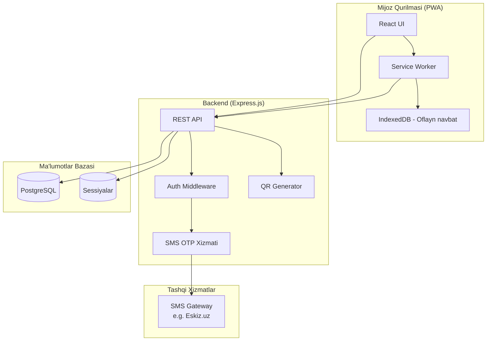
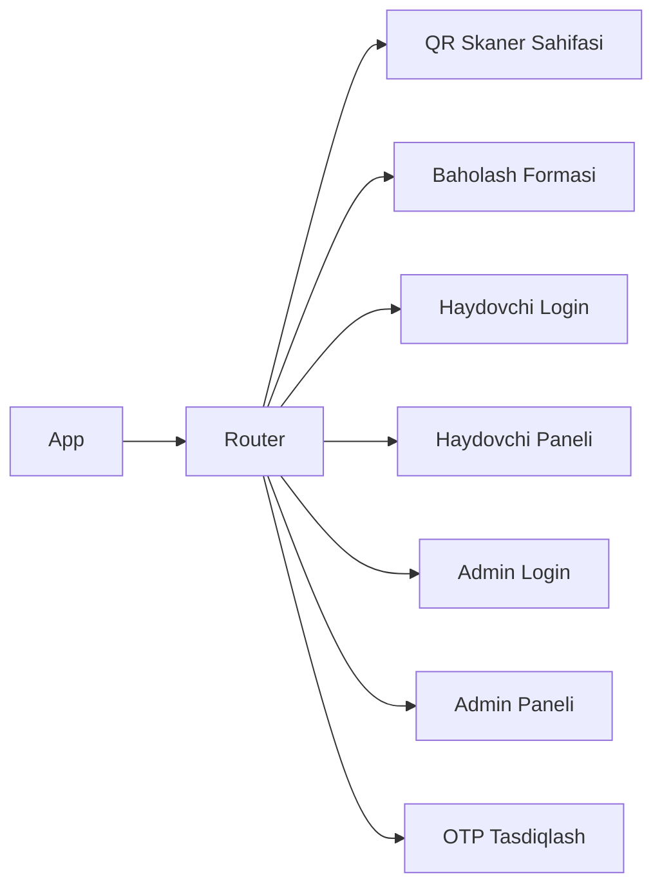

# Dizayn Hujjati: Shok Taksi Haydovchi Baholash PWA

## Umumiy Ko'rinish

"Shok Taksi" haydovchi baholash tizimi — mijozlar QR kod orqali haydovchini aniqlab, 5 yulduzli reyting va 4 kategoriyaviy baho qo'yishi mumkin bo'lgan Progressive Web App. Tizim uch rolni qo'llab-quvvatlaydi: **Mijoz** (anonim baholash), **Haydovchi** (o'z statistikasini ko'rish), **Admin** (to'liq boshqaruv).

Texnologiya stack:
- Frontend: React 18 + TypeScript + Vite + Tailwind CSS
- Backend: Node.js + Express.js + TypeScript
- Ma'lumotlar bazasi: PostgreSQL
- Autentifikatsiya: SMS OTP (sessiya asosida, doimiy)
- PWA: Service Worker + Web App Manifest

---

## Arxitektura



### Arxitektura Qarorlari

1. **JWT o'rniga sessiya**: Foydalanuvchi doim tizimda qolishi uchun `express-session` + PostgreSQL sessiya do'koni ishlatiladi. JWT 24 soatda muddati o'tadi, sessiya esa foydalanuvchi chiqmaguncha saqlanadi.
2. **SMS OTP**: Telefon raqami tasdiqlash uchun Eskiz.uz (O'zbekiston) yoki Twilio SMS gateway ishlatiladi.
3. **Oflayn navbat**: Baholashlar IndexedDB da saqlanadi, aloqa tiklanganda Background Sync orqali yuboriladi.
4. **Haydovchi ma'lumotlari maxfiyligi**: Haydovchi panelida mijoz telefon raqami, ismi va aniq baholash vaqti ko'rsatilmaydi — faqat oy/yil ko'rsatiladi.

---

## Komponentlar va Interfeyslari

### Frontend Komponentlar



### Backend API Endpointlari

| Method | Endpoint | Tavsif | Rol |
|--------|----------|--------|-----|
| GET | `/api/driver/:qrCode` | QR kod bo'yicha haydovchi ma'lumotlari | Ommaviy |
| POST | `/api/ratings` | Yangi baholash yuborish | Ommaviy |
| POST | `/api/auth/send-otp` | SMS OTP yuborish | Ommaviy |
| POST | `/api/auth/verify-otp` | OTP tasdiqlash va sessiya yaratish | Ommaviy |
| POST | `/api/auth/driver/login` | Haydovchi login (parol) | Ommaviy |
| POST | `/api/auth/logout` | Chiqish | Autentifikatsiya |
| GET | `/api/driver/me/stats` | Haydovchi o'z statistikasi | Haydovchi |
| GET | `/api/driver/me/ratings` | Haydovchi so'nggi baholashlari | Haydovchi |
| GET | `/api/admin/drivers` | Barcha haydovchilar ro'yxati | Admin |
| GET | `/api/admin/drivers/:id/ratings` | Haydovchi baholashlari | Admin |
| GET | `/api/admin/ratings` | Filtrlangan baholashlar | Admin |
| GET | `/api/admin/ratings/export` | CSV eksport | Admin |
| POST | `/api/admin/drivers/:id/block` | Haydovchini bloklash | Admin |
| GET | `/api/admin/qr/:driverId` | QR kod generatsiya | Admin |

---

## Ma'lumotlar Modellari

### PostgreSQL Jadvallar

```sql
-- Haydovchilar
CREATE TABLE drivers (
    id          UUID PRIMARY KEY DEFAULT gen_random_uuid(),
    full_name   VARCHAR(100) NOT NULL,
    car_number  VARCHAR(20) NOT NULL,
    qr_code     VARCHAR(64) UNIQUE NOT NULL,  -- noyob token
    is_blocked  BOOLEAN DEFAULT FALSE,
    password_hash VARCHAR(255) NOT NULL,       -- bcrypt
    created_at  TIMESTAMPTZ DEFAULT NOW()
);

-- Adminlar
CREATE TABLE admins (
    id            UUID PRIMARY KEY DEFAULT gen_random_uuid(),
    username      VARCHAR(50) UNIQUE NOT NULL,
    password_hash VARCHAR(255) NOT NULL,
    created_at    TIMESTAMPTZ DEFAULT NOW()
);

-- Baholashlar
CREATE TABLE ratings (
    id              UUID PRIMARY KEY DEFAULT gen_random_uuid(),
    driver_id       UUID NOT NULL REFERENCES drivers(id),
    phone_hash      VARCHAR(255) NOT NULL,  -- bcrypt hash, maxfiylik uchun
    overall_rating  SMALLINT NOT NULL CHECK (overall_rating BETWEEN 1 AND 5),
    cleanliness     VARCHAR(10) CHECK (cleanliness IN ('good','average','bad')),
    politeness      VARCHAR(10) CHECK (politeness IN ('good','average','bad')),
    driving_style   VARCHAR(10) CHECK (driving_style IN ('good','average','bad')),
    punctuality     VARCHAR(10) CHECK (punctuality IN ('good','average','bad')),
    comment         VARCHAR(500),
    created_at      TIMESTAMPTZ DEFAULT NOW()
);

-- OTP kodlar
CREATE TABLE otp_codes (
    id          UUID PRIMARY KEY DEFAULT gen_random_uuid(),
    phone       VARCHAR(20) NOT NULL,
    code_hash   VARCHAR(255) NOT NULL,  -- bcrypt hash
    expires_at  TIMESTAMPTZ NOT NULL,
    used        BOOLEAN DEFAULT FALSE,
    created_at  TIMESTAMPTZ DEFAULT NOW()
);

-- Brute-force himoya
CREATE TABLE login_attempts (
    id          UUID PRIMARY KEY DEFAULT gen_random_uuid(),
    identifier  VARCHAR(100) NOT NULL,  -- phone yoki username
    attempt_at  TIMESTAMPTZ DEFAULT NOW()
);

-- Sessiyalar (connect-pg-simple)
CREATE TABLE session (
    sid     VARCHAR NOT NULL COLLATE "default",
    sess    JSON NOT NULL,
    expire  TIMESTAMPTZ NOT NULL,
    CONSTRAINT session_pkey PRIMARY KEY (sid)
);
```

### TypeScript Interfeyslari

```typescript
// Haydovchi (frontend uchun)
interface Driver {
  id: string;
  fullName: string;
  carNumber: string;
  qrCode: string;
  isBlocked: boolean;
}

// Baholash so'rovi
interface RatingRequest {
  driverQrCode: string;
  phone: string;          // OTP tasdiqlangan telefon
  overallRating: 1 | 2 | 3 | 4 | 5;
  cleanliness?: 'good' | 'average' | 'bad';
  politeness?: 'good' | 'average' | 'bad';
  drivingStyle?: 'good' | 'average' | 'bad';
  punctuality?: 'good' | 'average' | 'bad';
  comment?: string;
}

// Haydovchi statistikasi (panel uchun)
interface DriverStats {
  averageRating: number;
  totalRatings: number;
  trend30Days: number;    // o'tgan 30 kun o'rtacha
  categoryAverages: {
    cleanliness: number;
    politeness: number;
    drivingStyle: number;
    punctuality: number;
  };
}

// Haydovchi paneli uchun baholash (maxfiy)
interface DriverRatingView {
  id: string;
  overallRating: number;
  cleanliness?: string;
  politeness?: string;
  drivingStyle?: string;
  punctuality?: string;
  comment?: string;
  monthYear: string;      // "2025-01" — aniq sana ko'rsatilmaydi
}

// Oflayn navbat elementi
interface OfflineRating extends RatingRequest {
  localId: string;
  savedAt: number;        // timestamp
  synced: boolean;
}
```

---

## To'g'rilik Xossalari

*Xossa — tizimning barcha to'g'ri bajarilishlarida rost bo'lishi kerak bo'lgan xususiyat yoki xatti-harakat. Xossalar inson o'qiydigan spetsifikatsiyalar va mashina tomonidan tekshiriladigan to'g'rilik kafolatlari o'rtasidagi ko'prik vazifasini bajaradi.*

### Xossa 1: Yulduz reytingi chegarasi

*Har qanday* baholash so'rovi uchun, `overallRating` qiymati doimo 1 dan 5 gacha butun son bo'lishi kerak — bu oraliqdan tashqari qiymat qabul qilinmasligi kerak.

**Tasdiqlaydi: Talab 2.3**

---

### Xossa 2: Izoh uzunligi cheklovi

*Har qanday* izoh matni uchun, 500 belgidan uzun matn yuborishga urinish rad etilishi va xato qaytarilishi kerak; 500 yoki undan kam belgili matn esa qabul qilinishi kerak.

**Tasdiqlaydi: Talab 4.2, 4.3**

---

### Xossa 3: 24 soatlik qayta baholash bloki

*Har qanday* telefon raqami va haydovchi QR kodi juftligi uchun, birinchi muvaffaqiyatli baholashdan so'ng 24 soat ichida ikkinchi baholash yuborishga urinish rad etilishi kerak.

**Tasdiqlaydi: Talab 5.4**

---

### Xossa 4: Oflayn baholash sinxronizatsiyasi

*Har qanday* oflayn rejimda saqlangan baholash uchun, aloqa tiklangandan so'ng u serverga yuborilishi va mahalliy navbatdan o'chirilishi kerak — natijada baholash yo'qolmasligi kerak.

**Tasdiqlaydi: Talab 5.3, 8.4**

---

### Xossa 5: Haydovchi faqat o'z ma'lumotlarini ko'radi

*Har qanday* autentifikatsiya qilingan haydovchi uchun, API so'rovlari faqat o'sha haydovchiga tegishli baholashlarni qaytarishi kerak — boshqa haydovchi ma'lumotlari hech qachon qaytarilmasligi kerak.

**Tasdiqlaydi: Talab 6.5**

---

### Xossa 6: Bloklangan haydovchi QR kodi ishlamaydi

*Har qanday* bloklangan haydovchi uchun, uning QR kodi orqali yangi baholash yuborishga urinish rad etilishi kerak.

**Tasdiqlaydi: Talab 7.6**

---

### Xossa 7: Brute-force himoyasi

*Har qanday* foydalanuvchi identifikatori (telefon yoki username) uchun, ketma-ket 5 ta noto'g'ri urinishdan so'ng keyingi urinish 15 daqiqa davomida bloklanishi kerak.

**Tasdiqlaydi: Talab 9.3**

---

### Xossa 8: OTP round-trip

*Har qanday* telefon raqami uchun, OTP yuborilgandan so'ng to'g'ri kodni kiritish sessiya yaratishi kerak; noto'g'ri yoki muddati o'tgan kod esa sessiya yaratmasligi kerak.

**Tasdiqlaydi: Talab 9 (OTP autentifikatsiya)**

---

### Xossa 9: Kategoriya bahosi validatsiyasi

*Har qanday* kategoriya bahosi uchun (`cleanliness`, `politeness`, `drivingStyle`, `punctuality`), faqat `'good'`, `'average'`, `'bad'` qiymatlari qabul qilinishi kerak — boshqa qiymatlar rad etilishi kerak.

**Tasdiqlaydi: Talab 3.3**

---

## Xatolarni Boshqarish

### Frontend

| Holat | Xato | Foydalanuvchiga ko'rsatish |
|-------|------|---------------------------|
| QR kod topilmadi | 404 | "QR kod yaroqsiz yoki topilmadi" |
| Haydovchi bloklangan | 403 | "Bu haydovchi hozirda baholanmaydi" |
| 24 soat bloki | 429 | "Siz bu haydovchini bugun allaqachon baholagansiz" |
| Server xatosi | 500 | "Xatolik yuz berdi. Keyinroq urinib ko'ring" |
| Oflayn | Network Error | "Oflayn rejim. Baholash saqlandi va keyinroq yuboriladi" |
| OTP muddati o'tgan | 410 | "Tasdiqlash kodi muddati o'tdi. Qayta so'rang" |
| Brute-force blok | 423 | "Juda ko'p urinish. 15 daqiqadan so'ng urinib ko'ring" |

### Backend

- Barcha xatolar `{ error: string, code: string }` formatida qaytariladi
- 5xx xatolar server loglariga yoziladi (foydalanuvchiga tafsilot ko'rsatilmaydi)
- OTP kodlar 5 daqiqada muddati o'tadi
- Muddati o'tgan OTP kodlar cron job orqali tozalanadi

---

## Sinov Strategiyasi

### Ikki qatlamli yondashuv

**Unit/Integratsiya testlari** — aniq misollar, chegara holatlari va xato shartlarini tekshiradi.
**Xossa asosidagi testlar** — universal xossalarni ko'p sonli tasodifiy kirishlar orqali tekshiradi.

Ikkalasi bir-birini to'ldiradi: unit testlar aniq xatolarni, xossa testlari umumiy to'g'rilikni kafolatlaydi.

### Xossa Asosidagi Testlar (Property-Based Testing)

Kutubxona: **fast-check** (TypeScript uchun)

Har bir xossa testi kamida **100 iteratsiya** bilan ishga tushirilishi kerak.

Har bir test quyidagi format bilan belgilanishi kerak:
```
// Feature: shok-taxi-driver-rating, Property N: <xossa matni>
```

| Xossa | Test tavsifi | fast-check generator |
|-------|-------------|---------------------|
| Xossa 1 | Tasodifiy butun sonlar uchun 1-5 oraliqdan tashqarilar rad etiladi | `fc.integer()` |
| Xossa 2 | Tasodifiy uzunlikdagi matnlar uchun >500 rad etiladi | `fc.string()` |
| Xossa 3 | Tasodifiy telefon + QR juftligi uchun 24 soat bloki ishlaydi | `fc.string(), fc.string()` |
| Xossa 4 | Tasodifiy baholashlar oflayn saqlanganda yo'qolmaydi | `fc.record(...)` |
| Xossa 5 | Tasodifiy haydovchi ID uchun faqat o'z ma'lumotlari qaytadi | `fc.uuid()` |
| Xossa 6 | Bloklangan haydovchi uchun har qanday QR so'rovi rad etiladi | `fc.uuid()` |
| Xossa 7 | Tasodifiy identifikator uchun 5 urinishdan so'ng bloklanadi | `fc.string()` |
| Xossa 8 | Tasodifiy telefon uchun to'g'ri OTP sessiya yaratadi | `fc.string()` |
| Xossa 9 | Tasodifiy kategoriya qiymatlari uchun faqat 3 ta qabul qilinadi | `fc.string()` |

### Unit Testlar

- QR kod generatsiya noyobligi
- Parol bcrypt hash/verify
- CSV eksport formati
- Sessiya yaratish/o'chirish
- Lighthouse PWA audit (CI da avtomatik)

### E2E Testlar (Playwright)

- Mijoz: QR skanerlash → baholash → tasdiqlash
- Haydovchi: Login → panel ko'rish
- Admin: Filtrlash → CSV eksport → bloklash
- Oflayn: Baholash saqlash → aloqa tiklash → sinxronizatsiya
